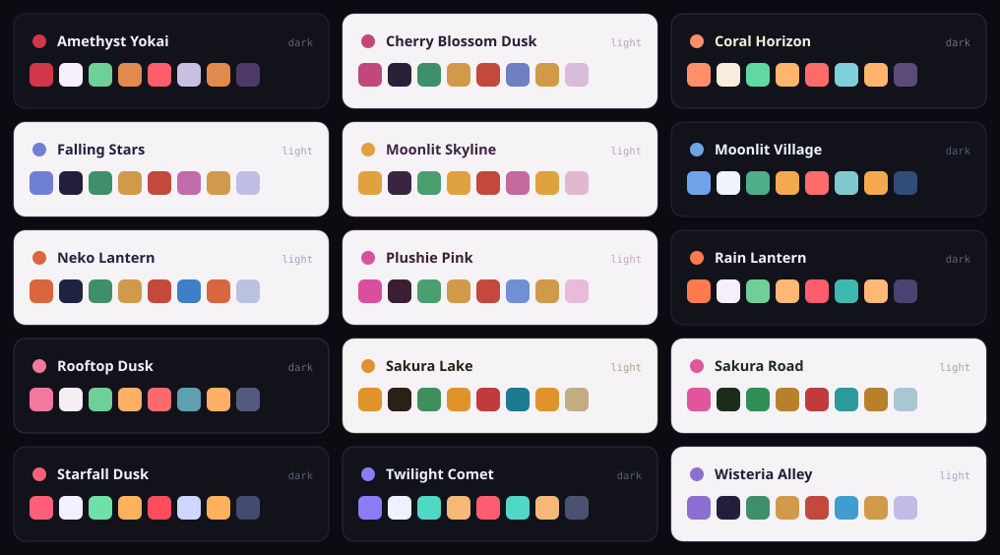

# yozora

Fifteen colour themes. Soft, saturated, mostly nocturnal.



Each one exists twice: as a terminal theme, and as a matching VS Code theme with the same
palette, so the editor and the terminal beside it do not fight.

| | |
| --- | --- |
| **Dark** | Amethyst Yokai · Coral Horizon · Moonlit Village · Rain Lantern · Rooftop Dusk · Starfall Dusk · Twilight Comet |
| **Light** | Cherry Blossom Dusk · Falling Stars · Moonlit Skyline · Neko Lantern · Plushie Pink · Sakura Lake · Sakura Road · Wisteria Alley |

## VS Code

```bash
git clone https://github.com/rlawoals0529/yozora
cp -R yozora/vscode ~/.vscode/extensions/yozora-themes
```

Reload the window, then pick one from the theme picker. All fifteen appear together.

## Terminal

`cli/` holds the same palettes in the JSON format the Claude Code CLI reads. Copy the one
you want into that tool's theme directory.

A theme is a small file, and every colour is named for the thing it means rather than for
where it appears:

```json
{
  "name": "Sakura Road",
  "base": "light",
  "overrides": {
    "text": "#1c2c1a",
    "success": "#2f8f52",
    "warning": "#b8802a",
    "error": "#c23b3b",
    "suggestion": "#2a9a9a"
  }
}
```

That naming is why the same palette works in two very different surfaces without being
re-picked for each.

## The swatch sheet is generated

```bash
node scripts/swatches.mjs
```

It reads `cli/` and writes `docs/palettes.svg`. A picture drawn by hand goes stale the
first time a colour changes and nobody notices; one generated from the themes cannot.

Re-run it after editing any palette.

## Making your own

Copy the closest existing theme, change the accent, and keep the semantic colours doing
their job — success stays legible as success, error stays legible as error. Most of these
started as a variation on one of the others.

Then regenerate the swatch sheet, so the picture and the palettes still agree.

MIT
